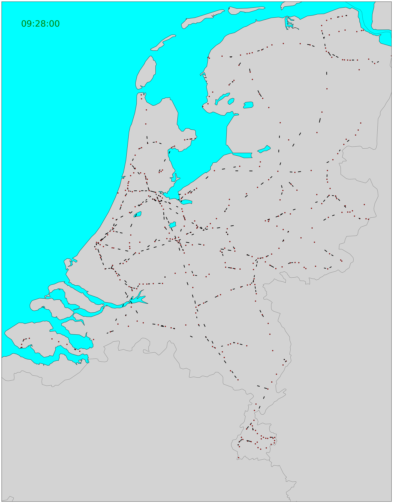

# "Real-time" train traffic in the Netherlands

For fun I've created a few scripts to reconstruct "real-time" train traffic in the Netherlands
using NS public API.



[For video and more information see](https://ifnull.org/articles/realtime_trains)

# Remaking a video
Just run main.py (it takes a long time and memory usage builds up). It requires a few things:
* python3
* python3-matplotlib
* python3-xmltodict
* python3-mpltoolkits.basemap

It loads data from **trains.json** and **stations.xml**.
Running this script produces lots of png files. ffmpeg can be used to make a video out of them:
``` bash
ffmpeg -framerate 10 -pattern_type glob -i '*.png' -c:v libx264 -pix_fmt yuv420p trains.mp4
```

# Collecting raw data from NS
**collect_data.sh** script saves current departure information for all stations in the Netherlands.
After that **make_trains.sh** reconstructs train routes and replaces **trains.json**.
To remake pngs run main.py
